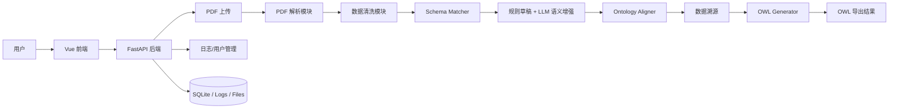
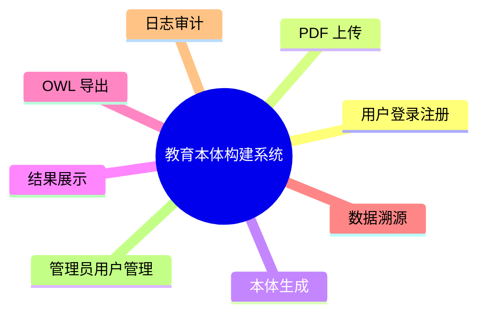
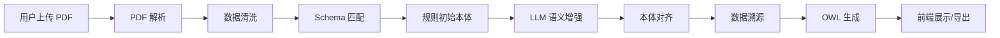
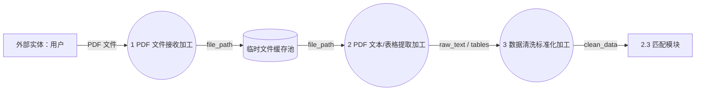

# 答辩 PPT 图示 Mermaid

## 系统总体架构

```mermaid
flowchart LR
  User[用户] --> Vue[Vue 前端]
  Vue --> API[FastAPI 后端]
  API --> Upload[PDF 上传]
  API --> Logs[日志/用户管理]
  Upload --> Parser[PDF 解析模块]
  Parser --> Cleaner[数据清洗模块]
  Cleaner --> Matcher[Schema Matcher]
  Matcher --> Builder[规则草稿 + LLM 语义增强]
  Builder --> Aligner[Ontology Aligner]
  Aligner --> Provenance[数据溯源]
  Provenance --> Owl[OWL Generator]
  Owl --> Export[OWL 导出结果]
  API --> Store[(SQLite / Logs / Files)]
```

## 功能模块图

```mermaid
mindmap
  root((教育本体构建系统))
    用户登录注册
    PDF 上传
    本体生成
    结果展示
    OWL 导出
    数据溯源
    日志审计
    管理员用户管理
```

## 核心业务流程

```mermaid
flowchart LR
  A[用户上传 PDF] --> B[PDF 解析]
  B --> C[数据清洗]
  C --> D[Schema 匹配]
  D --> E[规则初始本体]
  E --> F[LLM 语义增强]
  F --> G[本体对齐]
  G --> H[数据溯源]
  H --> I[OWL 生成]
  I --> J[前端展示/导出]
```

## PDF 文档解析与清洗 DFD

```mermaid
flowchart LR
  U[外部实体：用户] -- PDF 文件 --> P1((1 PDF 文件接收加工))
  P1 -- file_path --> S[(临时文件缓存池)]
  S -- file_path --> P2((2 PDF 文本/表格提取加工))
  P2 -- raw_text / tables --> P3((3 数据清洗标准化加工))
  P3 -- clean_data --> M[2.3 匹配模块]
```
