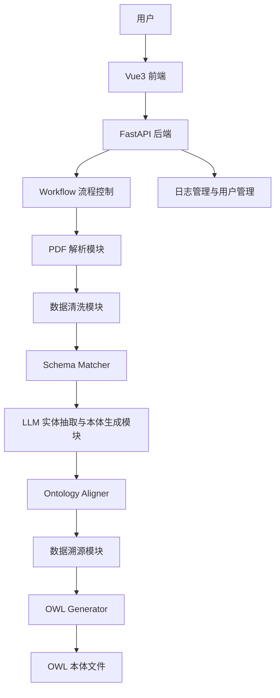

# 基于大模型智能体的教育本体构建系统设计文档

**版本：** V1.0  
**日期：** 2026年7月  
**项目名称：** 基于大模型智能体的教育本体构建系统

## 1. 项目概述

### 1.1 项目背景

教育领域存在大量非结构化和半结构化数据，常见数据来源包括教育标准规范文件、高校管理文档、专业建设方案、教学资源说明以及教育统计表格等。这些资料通常以 PDF 文件形式保存，具有格式不统一、字段命名差异大、表格结构复杂、知识更新维护困难等特点。

传统教育本体构建方式主要依赖领域专家人工阅读文档、抽取概念、设计类层次、定义属性和关系。该方式虽然准确性较高，但存在人工成本高、处理周期长、难以适应多源异构教育数据持续更新等问题。

为提高教育本体构建效率，本项目设计并实现一种基于大模型智能体的教育本体自动构建系统。系统结合 PDF 文档解析、数据清洗、大语言模型语义理解、Schema 匹配、本体对齐、数据溯源和 OWL 标准生成等技术，实现从教育领域 PDF 文档到标准本体文件的自动化转换。

### 1.2 建设意义

本系统面向教育信息化、教育数据治理和教育知识图谱建设场景，能够将分散在 PDF 文档中的教育管理信息、教育统计信息、高校基础信息和教育标准数据转化为结构化本体。系统可降低人工建模成本，提高本体构建效率，并为后续知识检索、知识问答、教育数据融合和语义分析提供基础支撑。

## 2. 系统设计目标

### 2.1 教育文档自动解析

系统支持用户上传教育领域 PDF 文件，自动提取文档中的文本内容、表格信息和基础结构信息。解析结果作为后续数据清洗、本体生成和数据溯源的输入。

### 2.2 数据标准化处理

针对不同来源教育文档中字段名称不同、表结构不同、数据格式不同等问题，系统对原始文本和表格数据进行统一处理，形成标准化结构数据。

示例映射如下：

| 原始字段 | 标准字段 |
| --- | --- |
| 课程名称 | course_name |
| 课程名 | course_name |
| 课程标题 | course_name |
| 学校名称 | school_name |
| 专业代码 | major_code |

### 2.3 大模型辅助本体生成

系统利用大语言模型完成教育语义理解和本体候选结构生成，包括实体识别、类概念发现、数据属性抽取、对象关系发现和本体结构生成。系统不固定预设 Student、Teacher、School 等类别，而是根据输入文档内容动态识别教育领域概念。

### 2.4 本体自动优化与融合

系统通过 Schema Matcher 和 Ontology Aligner 模块解决多源数据中的命名不一致和语义重复问题，包括删除重复类、合并相似属性、统一关系表达和保留跨文件来源信息。

### 2.5 OWL 标准导出

系统将生成的本体 JSON 转换为符合语义网标准的 RDF/XML 或 OWL 文件，包含 owl:Class、owl:DatatypeProperty、owl:ObjectProperty 以及来源注释信息，便于 Protégé、知识图谱平台或语义 Web 工具进一步使用。

## 3. 系统总体架构

系统采用前后端分离架构。前端基于 Vue3 实现用户交互，后端基于 FastAPI 提供文件上传、本体生成、结果导出、日志审计和数据溯源接口。核心业务流程由后端 Workflow 统一调度，各功能模块通过统一 state 对象传递中间数据。



系统整体处理链路如下：

1. 用户在前端上传 PDF 文件。
2. 后端保存文件并启动本体生成任务。
3. PDF 解析模块提取文本和表格。
4. 数据清洗模块将原始内容转换为标准 records。
5. Schema Matcher 统一字段命名和数据模式。
6. 大模型智能体生成类、属性和关系。
7. Ontology Aligner 对重复或相似本体元素进行合并。
8. 数据溯源模块记录本体元素来源。
9. OWL Generator 输出标准 OWL 文件。
10. 前端展示生成结果并支持下载导出。

## 4. 系统模块设计

### 4.1 PDF 解析模块

PDF 解析模块负责读取用户上传的 PDF 文件，并提取文本内容、表格数据和基础来源位置。

**输入：**

```json
{
  "file_path": "JYT1002_教育管理基础信息.pdf"
}
```

**输出：**

```json
{
  "raw_text": "",
  "tables": []
}
```

模块采用 pdfplumber 进行 PDF 解析。处理流程为：PDF 文件输入、逐页文本提取、表格提取、页面与表格位置信息记录、输出原始解析数据。

### 4.2 数据清洗模块

数据清洗模块将 PDF 原始内容转换为结构化数据，主要处理字段标准化、空值过滤、表格行转换、数据类型统一和来源信息保留。

**输出示例：**

```json
{
  "records": [
    {
      "id": "JCTB010101",
      "item_name": "学校名称",
      "cn_name": "学校名称",
      "data_type": "字符型",
      "source_table": "学校基本信息表"
    }
  ]
}
```

该模块为后续 Schema 匹配和大模型语义抽取提供统一输入。

### 4.3 大模型智能体模块

大模型智能体模块是系统的语义理解核心，用于从结构化教育数据中识别候选实体、类、属性和关系。

**输入：**

```json
{
  "records": []
}
```

**输出：**

```json
{
  "classes": [],
  "properties": [],
  "relations": []
}
```

Prompt 设计采用严格 JSON 约束，要求模型禁止输出 Markdown，必须返回可解析 JSON。模型根据教育数据语义动态发现本体概念，而不是依赖固定模板。

为提高系统稳定性，模块设置异常处理机制。当 API 调用失败、请求超时或模型输出无法解析时，系统使用规则生成结果作为备用，保证整体流程不中断。

### 4.4 Schema Matcher 模块

Schema Matcher 模块用于解决不同数据来源字段名称不一致的问题。系统将语义相近的字段映射到统一标准字段，使后续本体生成模块能够基于统一数据模式工作。

示例：

| 输入字段 | 匹配结果 |
| --- | --- |
| 课程名称 | course_name |
| 课程名 | course_name |
| 课程标题 | course_name |
| 学校名称 | school_name |

该模块同时保留 source_table、source_section、source 等来源字段，便于数据溯源。

### 4.5 Ontology Aligner 模块

Ontology Aligner 模块用于本体融合和结构优化，主要包括类对齐、属性对齐和关系对齐。

类对齐用于识别并删除重复概念，例如将语义一致或命名相近的类进行合并。属性对齐用于合并相似属性，例如同一 domain 下含义一致的字段。关系对齐用于统一关系表达，避免不同文件或不同模型输出中出现重复关系。

对齐后的本体结构更加简洁、规范，适合后续 OWL 生成和知识图谱构建。

### 4.6 OWL Generator 模块

OWL Generator 模块负责将本体 JSON 转换为 OWL 文件。系统根据 ontology 中的 classes、datatype_properties、object_properties 和 relations 生成 RDF/XML 格式内容。

生成内容包括：

| 本体元素 | OWL 表达 |
| --- | --- |
| 类 | owl:Class |
| 数据属性 | owl:DatatypeProperty |
| 对象属性 | owl:ObjectProperty |
| 类层级 | rdfs:subClassOf |
| 数据类型 | xsd:string、xsd:integer 等 |
| 来源信息 | edu:sourceFile、edu:sourcePage、edu:sourceRow |

### 4.7 数据溯源模块

数据溯源模块用于记录本体元素来源，提升本体生成结果的可解释性和可追踪性。

记录内容包括文件名称、页码、表格编号、行号、字段名称和原始文本证据。

示例：

```json
{
  "element": "School",
  "type": "class",
  "sources": [
    {
      "source_file": "JYT1002_教育管理基础信息.pdf",
      "source_page": 3,
      "source_table": "学校基本信息表",
      "source_field": "学校名称"
    }
  ]
}
```

### 4.8 日志管理模块

日志管理模块记录用户操作、上传记录、本体生成记录、导出记录和系统运行日志。管理员可查看系统级日志和用户操作日志，普通用户可查看自己的生成历史和操作记录。

日志审计功能有助于系统问题排查、过程追踪和实验结果复现。

### 4.9 前端展示模块

前端基于 Vue3、Vite 和 Axios 实现，主要提供登录注册、PDF 上传、本体生成、任务进度展示、结果查看、OWL 下载、数据溯源查询和日志查看等页面。

前端通过 REST API 与后端通信，并对本体生成状态、错误信息和导出结果进行可视化展示。

## 5. 数据结构设计

系统使用统一状态对象 state 在各模块之间传递数据。

```json
{
  "file_path": "",
  "raw_text": "",
  "tables": [],
  "clean_data": {},
  "ontology": {},
  "trace_map": {},
  "trace_file": "",
  "owl_file": ""
}
```

其中：

| 字段 | 说明 |
| --- | --- |
| file_path | 上传 PDF 文件路径 |
| raw_text | PDF 提取出的原始文本 |
| tables | PDF 提取出的表格数据 |
| clean_data | 清洗后的结构化 records |
| ontology | 生成并对齐后的本体 JSON |
| trace_map | 本体元素与原始数据的溯源映射 |
| trace_file | 溯源结果文件路径 |
| owl_file | 导出的 OWL 文件路径 |

本体 JSON 核心结构如下：

```json
{
  "classes": [
    {
      "name": "School",
      "label": "学校"
    }
  ],
  "datatype_properties": [
    {
      "name": "school_name",
      "label": "学校名称",
      "domain": "School",
      "range": "string"
    }
  ],
  "object_properties": [
    {
      "name": "hasMajor",
      "domain": "School",
      "range": "Major"
    }
  ],
  "relations": [
    {
      "source": "School",
      "target": "Major",
      "type": "hasMajor"
    }
  ]
}
```

## 6. 接口设计

系统后端提供 REST API，核心接口如下：

| 接口 | 方法 | 功能 |
| --- | --- | --- |
| /upload | POST | 上传单个 PDF 文件 |
| /upload/batch | POST | 批量上传 PDF 文件 |
| /generate | POST | 同步生成本体 |
| /generate/start | POST | 启动异步生成任务 |
| /generate/progress/{job_id} | GET | 查询生成进度 |
| /generate/result/{job_id} | GET | 查询生成结果 |
| /generate/batch | POST | 批量生成并融合本体 |
| /export | GET | 导出 OWL 文件 |
| /sources/search | GET | 查询数据溯源 |
| /logs/my-operations | GET | 查询当前用户操作日志 |
| /admin/logs/operations | GET | 管理员查询操作日志 |
| /auth/register | POST | 用户注册 |
| /auth/login | POST | 用户登录 |
| /auth/me | GET | 获取当前用户信息 |
| /health | GET | 健康检查 |

## 7. 技术架构

### 7.1 前端技术

| 技术 | 用途 |
| --- | --- |
| Vue3 | 构建前端页面和组件 |
| Vite | 前端构建与开发服务 |
| Axios | 请求后端 REST API |
| JavaScript / CSS | 页面交互与样式实现 |

### 7.2 后端技术

| 技术 | 用途 |
| --- | --- |
| FastAPI | 构建后端 API 服务 |
| Python | 后端开发语言 |
| pdfplumber | PDF 文本和表格解析 |
| SQLite | 用户、日志和生成记录存储 |
| JSON | 模块间中间数据格式 |

### 7.3 AI 与语义技术

| 技术 | 用途 |
| --- | --- |
| 大语言模型 API | 实体抽取、本体生成和关系推理 |
| Prompt 工程 | 约束模型输出结构 |
| Schema Matching | 字段语义标准化 |
| Ontology Alignment | 本体融合与去重 |
| RDF / OWL | 标准本体输出 |

## 8. 业务流程设计

系统核心业务流程分为单文件本体构建流程和多文件本体融合流程。

### 8.1 单文件本体构建流程


### 8.2 多文件本体融合流程

多文件场景下，系统先分别解析和生成单文件本体，再进行跨文件本体对齐与合并。合并过程中保留 source_files、source_record_ids 和 sources 等来源信息，确保融合后的本体仍可追溯到原始文件。

## 9. 安全性与异常处理设计

系统在文件上传、模型调用和结果导出过程中设置基础安全与异常处理机制。

文件上传阶段限制文件类型为 PDF，并将文件保存到后端指定目录。模型调用阶段设置超时、重试和 fallback 机制，避免模型服务异常导致流程失败。JSON 解析阶段对模型输出进行格式校验，无法解析时回退到规则生成结果。导出阶段检查 OWL 文件路径和文件存在性，避免无效下载。

用户侧通过登录认证区分普通用户和管理员。普通用户只能查看自己的上传记录、生成记录和操作日志，管理员可查看系统级审计信息。

## 10. 系统特点

本系统具有以下特点：

1. 大模型驱动教育知识抽取，能够从 PDF 文档中自动识别教育领域概念、属性和关系。
2. 支持非结构化和半结构化 PDF 数据到本体结构的自动转换。
3. 结合 Schema Matcher 和 Ontology Aligner，实现字段标准化和本体融合。
4. 支持 OWL 标准导出，便于与语义 Web 工具和知识图谱平台集成。
5. 支持数据溯源，能够追踪本体元素对应的原始文件、页码、表格和字段。
6. 支持日志审计和用户管理，便于系统维护、演示和问题排查。
7. 支持规则 fallback，在大模型不可用时仍能生成基础本体结果。

## 11. 总结

基于大模型智能体的教育本体构建系统围绕“教育 PDF 文档解析、结构化数据清洗、语义本体生成、本体对齐融合、OWL 标准导出”构建完整处理链路。系统将传统依赖人工专家的教育本体构建过程转化为可自动运行、可追溯、可扩展的软件流程，提高了教育领域知识组织与知识建模的效率。

后续可继续在本体质量评估、人工审核闭环、知识图谱可视化、多模型协同抽取和跨标准本体映射等方面进行增强。
