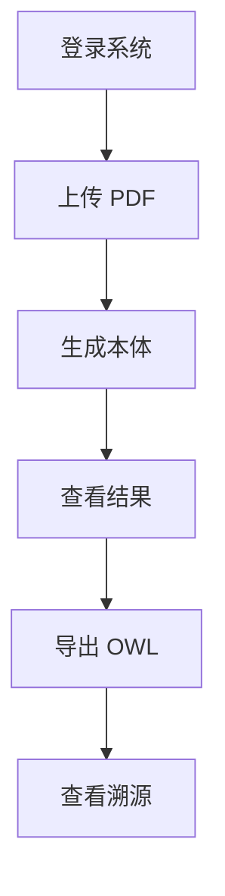

# 基于大模型智能体的教育本体构建系统用户使用说明

**版本：** V1.0

## 1. 系统简介

本系统用于自动将教育领域 PDF 文档转换为标准化教育本体。用户只需要按照“上传 PDF、生成本体、查看结果、导出 OWL”的流程操作，即可完成教育知识结构构建。

基本流程如下：


系统主要支持：

| 功能 | 说明 |
| --- | --- |
| PDF 上传 | 上传教育标准、管理文档、统计文档等 PDF 文件 |
| 本体生成 | 自动执行 PDF 解析、数据清洗、LLM 抽取、本体对齐和 OWL 生成 |
| 结果查看 | 查看生成的类、属性和关系 |
| OWL 导出 | 下载标准 OWL 本体文件 |
| 数据溯源 | 查询本体元素对应的来源文件、页码和原始字段 |
| 日志管理 | 查看用户操作记录和本体生成记录 |

## 2. 环境要求

### 2.1 后端环境

| 环境 | 要求 |
| --- | --- |
| Python | 3.10+ |
| 后端框架 | FastAPI |
| PDF 解析 | pdfplumber |

### 2.2 前端环境

| 环境 | 要求 |
| --- | --- |
| Node.js | 18+ |
| 前端框架 | Vue3 |
| 构建工具 | Vite |

## 3. 系统部署

### 3.1 后端启动

进入后端目录：

```bash
cd backend
```

安装依赖：

```bash
pip install -r requirements.txt
```

配置环境变量文件：

```bash
.env
```

常见配置包括大模型 API Key、模型名称、服务地址等。

启动后端服务：

```bash
uvicorn main:app --reload
```

后端访问地址：

```text
http://127.0.0.1:8000
```

健康检查地址：

```text
http://127.0.0.1:8000/health
```

### 3.2 前端启动

进入前端目录：

```bash
cd frontend
```

安装依赖：

```bash
npm install
```

启动前端服务：

```bash
npm run dev
```

前端访问地址：

```text
http://localhost:5173
```

## 4. 用户操作流程

### 4.1 用户登录

打开前端页面后，用户输入用户名和密码登录系统。登录成功后，系统进入主页面。

如果用户尚未注册，可先进行注册，再使用注册账号登录。

### 4.2 上传 PDF

进入上传页面，选择教育领域 PDF 文件，点击上传按钮。系统会将文件保存到后端，并返回上传结果。

建议上传内容清晰、格式完整的 PDF 文件，例如教育管理基础信息、教育行政管理信息、高等学校管理信息、教育统计信息等文档。

### 4.3 生成本体

上传成功后，点击生成本体按钮。系统将自动执行以下流程：


生成过程中，系统会解析 PDF 文本和表格，清洗为结构化数据，再通过大模型抽取类、属性和关系，最后生成标准本体文件。

### 4.4 查看生成结果

本体生成完成后，用户可以在结果页面查看：

| 结果类型 | 说明 |
| --- | --- |
| 类列表 | 展示识别出的教育领域概念 |
| 属性列表 | 展示类对应的数据属性 |
| 关系列表 | 展示类与类之间的对象关系 |
| 生成信息 | 展示生成状态、文件路径和相关提示 |

### 4.5 导出 OWL

点击导出 OWL 按钮后，系统生成并下载本体文件。

导出文件命名示例：

```text
ontology_xxx.owl
```

该文件可用于 Protégé、语义 Web 工具或知识图谱系统。

### 4.6 查看数据溯源

进入数据溯源页面，输入类名、属性名或关系名进行查询。系统返回对应的来源信息，包括：

| 溯源信息 | 说明 |
| --- | --- |
| 来源文件 | 本体元素来自哪个 PDF 文档 |
| 页码 | 对应内容所在页 |
| 表格 | 对应内容所在表格 |
| 原始字段 | PDF 或表格中的原始字段名称 |

示例：

```text
查询：School
返回：JYT1002_教育管理基础信息.pdf，第 3 页，学校名称字段
```

## 5. 管理功能

管理员登录后，可以查看系统管理功能，包括：

| 管理功能 | 说明 |
| --- | --- |
| 用户信息 | 查看系统用户列表和用户基础信息 |
| 操作日志 | 查看用户登录、上传、生成、导出等操作记录 |
| 生成记录 | 查看本体生成历史和生成状态 |
| 系统日志 | 查看后端运行日志和异常信息 |

普通用户只能查看自己的操作记录和生成记录。

## 6. 常见问题

### Q1：上传失败怎么办？

请检查：

1. 文件是否为 PDF 格式。
2. 文件是否过大。
3. 后端服务是否已经启动。
4. 当前账号是否已经登录。

### Q2：本体生成失败怎么办？

请检查：

1. `.env` 中 API Key 是否正确配置。
2. 网络连接是否正常。
3. 大模型服务地址和模型名称是否正确。
4. 上传文件是否能够正常解析。

如果大模型不可用，系统会尽量使用规则生成基础结果。

### Q3：OWL 文件无法打开怎么办？

请检查：

1. 文件是否下载完整。
2. OWL 文件是否为空。
3. XML 格式是否正确。
4. 是否使用 Protégé 或支持 OWL/RDF 的工具打开。

### Q4：结果中类或属性较少怎么办？

请检查 PDF 内容是否包含明确的表格字段、教育概念或结构化描述。对于扫描版 PDF，系统可能无法准确提取文字，需要先进行 OCR 处理。

## 7. 使用流程总结

系统推荐使用流程如下：



用户按照以上流程操作，即可完成从教育 PDF 文档到 OWL 本体文件的自动化构建。
